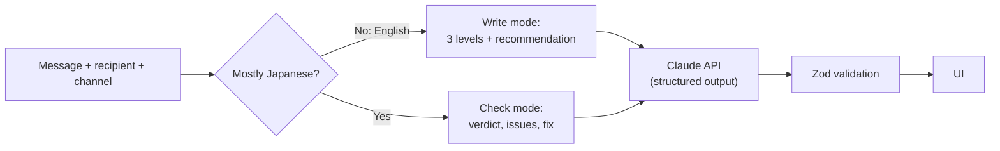

# Keigo Bridge 敬語ブリッジ

Say it the right way in Japanese for whoever you're talking to.

- **Type in English** → get the message in casual, polite and keigo Japanese, with a recommendation for your recipient and channel.
- **Paste your own Japanese** → find out whether the tone fits, which phrases are off, and get a corrected version.

Every Japanese output comes with romaji and an English back-translation of *the Japanese itself*, so you can check what you'd actually be saying before you send it.

**Live demo:** _add your Vercel URL here_

<p>
  
  
</p>

_UI preview in demo mode (sample data)._

## Why

Living in Japan while learning the language, the hard part often isn't vocabulary. It's knowing how polite to be. The same request needs different Japanese for a friend, a landlord, a boss or a client, and machine translation picks one level without telling you which, or whether it fits.

## How it works



| Piece | Where |
|---|---|
| Language detection (English vs Japanese) | [`src/lib/detect.ts`](src/lib/detect.ts) |
| System prompt and per-mode instructions | [`src/lib/prompt.ts`](src/lib/prompt.ts) |
| Output schemas (Zod → JSON Schema) | [`src/lib/schemas.ts`](src/lib/schemas.ts) |
| Claude call, refusal handling | [`src/lib/analyze.ts`](src/lib/analyze.ts) |
| API route, rate limit, error mapping | [`src/app/api/analyze/route.ts`](src/app/api/analyze/route.ts) |
| UI | [`src/components/`](src/components) |

## Decisions and tradeoffs

- **Mode detection happens in code, not in the model.** The UI shows "English detected" or "Japanese detected" as you type, before anything is sent. It costs nothing and can be unit-tested. Japanese characters are weighted 3× against Latin letters, so a Japanese draft with a loanword like "meeting" still counts as Japanese.
- **Structured outputs, with the JSON Schema generated from Zod.** The API is constrained to the same schema the server validates against, so the two can't drift. Field descriptions in the schema double as instructions to the model.
- **Back-translate the output, not the input.** Repeating the user's English back to them proves nothing. Translating the Japanese back shows what the recipient will actually read.
- **The recipient has no default.** The right politeness depends entirely on who it's for, so the user has to choose; a silent default would give confident wrong answers.
- **Model: Claude Opus 5.5 at medium effort.** Nuanced social judgement is the whole product, so quality comes before cost per request. `ANTHROPIC_MODEL` switches models (for example `claude-sonnet-5-5`, half the price); rerun the eval to compare before switching.
- **Refusal fallback is on.** If a safety classifier declines a request, the API retries it on a fallback model inside the same call instead of returning nothing.
- **Cost protection:** messages are capped at 1,000 characters, each IP gets 10 requests per 10 minutes, and the hard limit is a monthly spend limit set in the Anthropic Console. The rate limiter lives in memory, so on serverless it is per instance and best-effort.
- **Left out on purpose:** accounts, history and streaming. Answers are short, so a spinner is acceptable for a first version.

## Evaluation

[`evals/cases.json`](evals/cases.json) has 20 labelled cases across 9 recipient types and 3 channels: 12 Japanese drafts to check (too casual, too formal, mixed levels, honorifics used in the wrong direction such as ご苦労様です to a boss, and drafts that are fine as written) and 8 English messages to write.

```bash
npm run eval            # all cases, roughly $1-2 on the default model
npm run eval -- --only check-boss   # a subset
```

Each run writes a report to `evals/results/` with two kinds of score:

1. **Automatic:** did it choose an acceptable level (write mode) or the expected verdict (check mode)?
2. **Human:** a blank "Native grade (1-5)" column for a native speaker to rate whether the Japanese sounds natural. No automatic check can do this part.

Unit tests (`npm test`) also check that every eval case is routed to the right mode, without calling the API.

**Latest results:** _not run yet_

## Run it locally

Requires Node.js 22+ and an Anthropic API key ([console.anthropic.com](https://console.anthropic.com), billed separately from a Claude.ai subscription).

```bash
npm install
cp .env.example .env.local   # then paste your key into .env.local
npm run dev                  # http://localhost:3000
```

To work on the UI without a key, set `MOCK_CLAUDE=1` in `.env.local`. The API then returns fixed sample answers, and the page labels them as demo data.

Checks: `npm test`, `npm run typecheck`, `npm run lint`.

## Deploy

1. Import the repo at [vercel.com/new](https://vercel.com/new).
2. Add `ANTHROPIC_API_KEY` under Environment Variables.
3. Set a monthly spend limit in the Anthropic Console before sharing the link.

## Limitations

- Romaji and back-translations are model-generated and can be wrong. The footer says so, and anything important should be checked by a native speaker.
- The eval labels follow standard Japanese etiquette guidance and should be reviewed by a native speaker. Some contexts accept two levels, and the cases allow for that.
- The rate limiter isn't shared between serverless instances (see above).

## Tech

Next.js 16 (App Router) · TypeScript · Tailwind CSS 4 · Anthropic TypeScript SDK · Zod 4 · Vitest

## License

Copyright 2026 maynee99. Licensed under the Apache License, Version 2.0. See [LICENSE](LICENSE).
