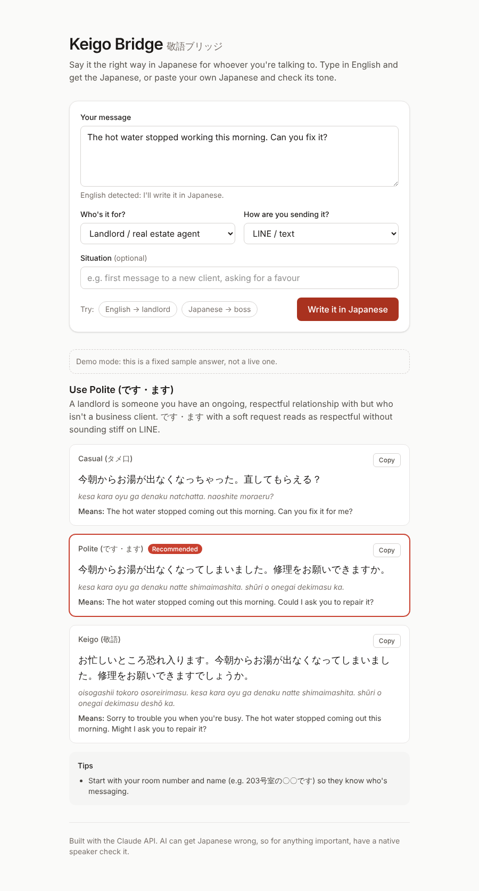
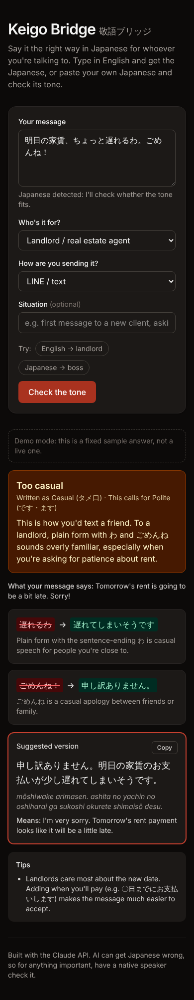
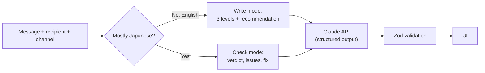

# Keigo Bridge 敬語ブリッジ

Say it the right way in Japanese for whoever you're talking to.

- **Type in English** → get the message in casual, polite and keigo Japanese, with a recommendation for your recipient and channel.
- **Paste your own Japanese** → find out whether the tone fits, which phrases are off, and get a corrected version.

Every Japanese output comes with romaji and an English back-translation of *the Japanese itself*, so you can check what you'd actually be saying before you send it.

**Live demo:** https://keigo-bridge.vercel.app

<p>
  
  
</p>

_UI preview in demo mode (sample data)._

## Why I built this

I built this because I have found that navigating the Japanese language is incredibly nuanced, and knowing what tone to use in what situation is something that comes with experience. I am still early into my time in Japan, and as such I created this tool to assist me in my day-to-day life.

The same request needs different Japanese for a friend, a landlord, a boss or a client, and getting it wrong can make you sound rude or strangely stiff. Translation apps pick one level without telling you which, or whether it fits the person you're talking to. Keigo Bridge tells me which level to use for this person, shows me exactly what I'd be saying, and checks my own Japanese before I send it. I hope it makes everyday life a little easier for anyone else in Japan who is still learning the language.

I built it with [Claude Code](https://claude.com/claude-code). The decisions below are the ones that shaped it.

## How it works



| Piece | Where |
|---|---|
| Language detection (English vs Japanese) | [`src/lib/detect.ts`](src/lib/detect.ts) |
| System prompt and per-mode instructions | [`src/lib/prompt.ts`](src/lib/prompt.ts) |
| Output schemas (Zod → JSON Schema) | [`src/lib/schemas.ts`](src/lib/schemas.ts) |
| Claude call, refusal handling | [`src/lib/analyze.ts`](src/lib/analyze.ts) |
| API route, rate limit, error mapping | [`src/app/api/analyze/route.ts`](src/app/api/analyze/route.ts) |
| UI | [`src/components/`](src/components) |

## Decisions and tradeoffs

Every decision starts from the person using it: someone in Japan, about to send a message, who can't fully judge the Japanese themselves.

**Product**

- **Show what the Japanese actually says.** Each result includes an English back-translation of the Japanese itself, not a repeat of what you typed. If you can't fully read the output, that's the only way to know what you're about to send.
- **Make you choose who it's for.** The right politeness depends entirely on the recipient, so there is no default. A silent default would give confident wrong answers.
- **Work in both directions.** Learners often write their own Japanese and just want it checked. Pasting Japanese gets a verdict, the exact phrases that are off and a fix, instead of a translation of something you already wrote.
- **Left out on purpose:** accounts, history and streaming. Answers are short, so a loading state is fine for a first version.

**Technical**

- **Detect the language in code, not with the AI.** The page says "English detected" or "Japanese detected" as you type, before anything is sent. It's instant, free and unit-tested. Japanese characters are weighted 3× against Latin letters, so a Japanese draft with a loanword like "meeting" still counts as Japanese.
- **Structured output, checked twice.** Claude's answer is constrained to a JSON Schema generated from the same Zod schema the server validates against, so the UI never parses free text and the two can't drift. Field descriptions in the schema double as instructions to the model.
- **Quality over cost per request.** Getting social nuance right is the whole point, so it runs on Claude Opus 5.5 at medium effort. `ANTHROPIC_MODEL` switches models (for example `claude-sonnet-5-5`, half the price); rerun the eval to compare before switching.
- **Never fail silently.** If a safety classifier declines a request, the API retries it on a fallback model in the same call. If that fails too, the user gets a plain-English message instead of a blank screen.
- **Keep a public demo affordable.** Messages are capped at 1,000 characters, and each IP gets 10 requests per 10 minutes. That limiter lives in memory, so on serverless it is per instance and best-effort; the hard cap is a monthly spend limit set in the Anthropic Console.

## Evaluation

[`evals/cases.json`](evals/cases.json) has 20 labelled cases across 9 recipient types and 3 channels: 12 Japanese drafts to check (too casual, too formal, mixed levels, honorifics used in the wrong direction such as ご苦労様です to a boss, and drafts that are fine as written) and 8 English messages to write.

```bash
npm run eval            # all cases, roughly $1-2 on the default model
npm run eval -- --only check-boss   # a subset
```

Each run writes a report to `evals/results/` with two kinds of score:

1. **Automatic:** did it choose an acceptable level (write mode) or the expected verdict (check mode)?
2. **Human:** a blank "Native grade (1-5)" column for a native speaker to rate whether the Japanese sounds natural. No automatic check can do this part.

Unit tests (`npm test`) also check that every eval case is routed to the right mode, without calling the API.

**Latest results** (2026-10-07, `claude-opus-5-5`): **20/20** cases picked the expected level or verdict, with an average response time of 9.4s. Full report: [`evals/results/2026-10-07-claude-opus-5-5.md`](evals/results/2026-10-07-claude-opus-5-5.md). This only scores the decision; the native-speaker grades for how natural the Japanese sounds are still blank.

## Run it locally

Requires Node.js 22+ and an Anthropic API key ([console.anthropic.com](https://console.anthropic.com), billed separately from a Claude.ai subscription).

```bash
npm install
cp .env.example .env.local   # then paste your key into .env.local
npm run dev                  # http://localhost:3000
```

To work on the UI without a key, set `MOCK_CLAUDE=1` in `.env.local`. The API then returns fixed sample answers, and the page labels them as demo data.

Checks: `npm test`, `npm run typecheck`, `npm run lint`.

## Deploy

1. Import the repo at [vercel.com/new](https://vercel.com/new).
2. Add `ANTHROPIC_API_KEY` under Environment Variables.
3. Set a monthly spend limit in the Anthropic Console before sharing the link.

## Limitations

- Romaji and back-translations are model-generated and can be wrong. The footer says so, and anything important should be checked by a native speaker.
- The eval labels follow standard Japanese etiquette guidance and should be reviewed by a native speaker. Some contexts accept two levels, and the cases allow for that.
- The rate limiter isn't shared between serverless instances (see above).

## Tech

Next.js 16 (App Router) · TypeScript · Tailwind CSS 4 · Anthropic TypeScript SDK · Zod 4 · Vitest

## License

Copyright 2026 maynee99. Licensed under the Apache License, Version 2.0. See [LICENSE](LICENSE).
